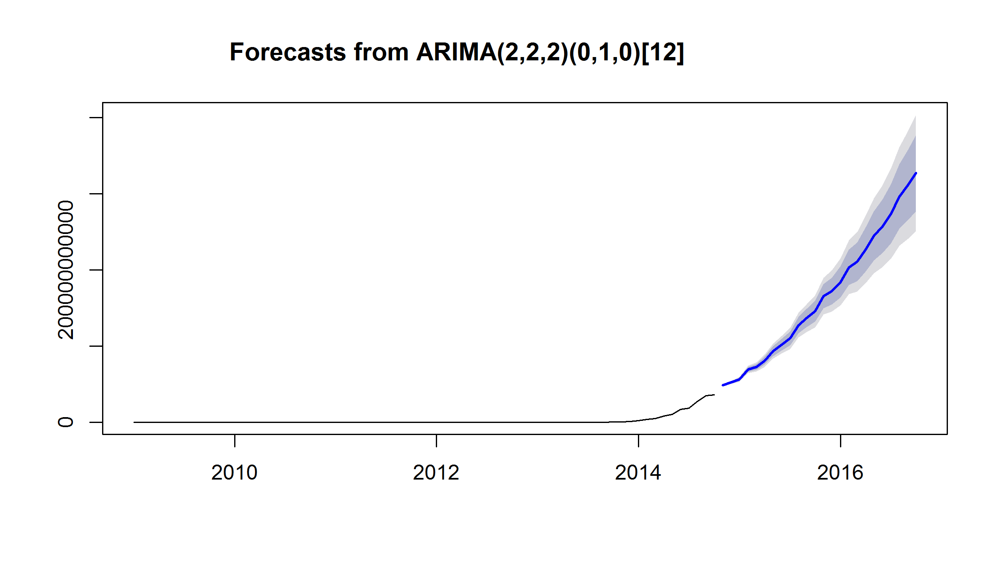

Estimating Future Bitcoin Profit
========================================================
author: Trenton Potgieter
date: 10/19/2014
font-family: 'Helvetica'

Introduction
========================================================

<small>Understanding just how difficult it is to discover the given number below the given target is the key to determining Bitcoin profitability.  

Furthermore, the ability to estimate future mining profitability by predicting what the network difficulty will be is the scope of this presentation. The process of forecasting what the network difficulty will be and calculating the profitability is accomplished by means of the following steps:  

- Download the data from the Network.  
- Clean and format the data, by Date and Difficulty.  
- Forcast the dicculty over the next 24 months.  
- Plot the Forecast</small>

Example Forecast of the Difficulty
========================================================


```r
head(x, 5)
```

```
         Point Forecast       Lo 80       Hi 80       Lo 95       Hi 95
Nov 2014    48365626870 47374491687 49356762052 46849816415 49881437325
Dec 2014    52153751159 51025378546 53282123773 50428054166 53879448153
Jan 2015    56395199463 54300203063 58490195863 53191178959 59599219966
Feb 2015    69182084441 65986038799 72378130083 64294154435 74070014447
Mar 2015    72766109760 68884607605 76647611916 66829864481 78702355039
```

Plotting the Difficulty Forecast
========================================================



Shiny App
========================================================
class: illustration
Screenshot of the shiny Web App that performs the Forecast.


